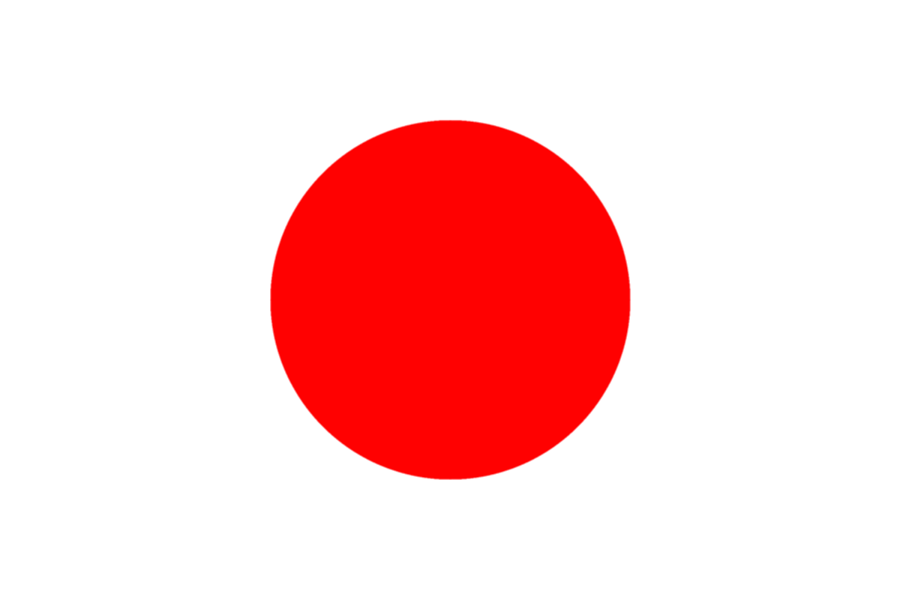
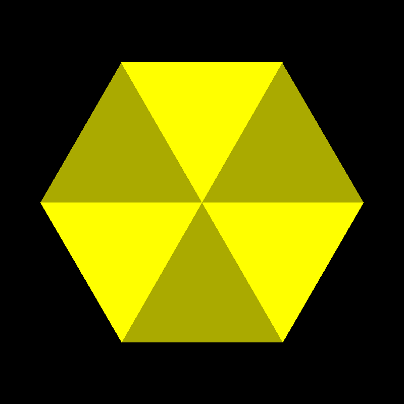
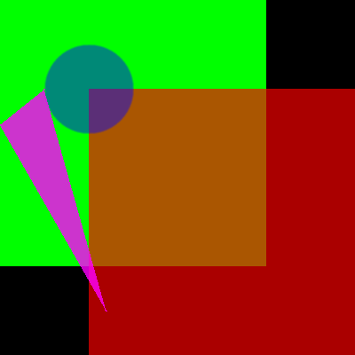

# Examples
The demo currently generates tests when run with --record=true,
these are then saved to [``./tests/``](./tests/) and added to this repository.
When executing the demo using ``./run.sh`` a directory called ``./run`` gets created,
and any generated files are created in there.

If you were to run the code using ``./run.sh --record=true`` you would record new tests from scratch and overwrite any existing tests with new ones.

If you want to test any changes against existsing tests, run the program using ``./run.sh --test=true``.

Here are a few examples from the [``./tests/``](./tests/) directory.

## japan.png

This generates a correct Japan flag

## lines.png
This generates lines in a circular-ish shape

## triangle.png
This generates 6 triangles in a hexagon

## alphablend.png
This uses the alpha channel to blend the shapes with each other

