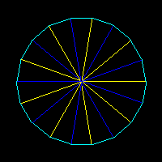
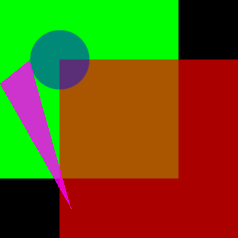

# Krint.c [](https://github.com/Kirdow/Krintc/blob/master/LICENSE)
Graphics library by Kirdow made in C.

Krint.c is a purely software based renderer made in C using the C11 standard. It's made specifically under windows but tries to support POSIX and UNIX whenever possible.

**Features:**
* Fill Clear
* Fill Rect
* Fill Circle
* Fill Triangle
* Draw Line
* Alpha Blending

**Planned:**
* Anti Aliasing
* 3D Projection (probably not too advanced for a start)

## Build & Run

First build the demo
```sh
./build.sh
```

Then run the demo
```sh
./run.sh
```

# Examples
The demo currently generates tests when run with --record=true,
these are then saved to [``./tests/``](./tests/) and added to this repository.
When executing the demo using ``./run.sh`` a directory called ``./run`` gets created,
and any generated files are created in there.

If you were to run the code using ``./run.sh --record=true`` you would record new tests from scratch and overwrite any existing tests with new ones.

If you want to test any changes against existsing tests, run the program using ``./run.sh --test=true``.

<details>
<summary>Here are a few examples from the [``./tests/``](./tests/) directory.</summary>

## japan.png
<details>
<summary>This generates a correct Japan flag</summary>


</details>

## lines.png
<details>
<summary>This generates lines in a circular-ish shape</summary>


</details>

## triangle.png
<details>
<summary>This generates 6 triangles in a hexagon</summary>


</details>

## alphablend.png
<details>
<summary>This uses the alpha channel to blend the shapes with each other</summary>


</details>

</details>
# Contributions
Any help is welcome, but please don't make any major pull requests unless I'm specifically asking for it or approved it in an issue. If you got any questions or thoughts, make an issue.

# Credits
Inspired by [Olive.c](https://github.com/tsoding/olive.c) by [Tsoding](https://www.youtube.com/@TsodingDaily).

# License
This project uses [MIT License](https://github.com/Kirdow/Krintc/blob/master/LICENSE).
